# radar-microServices

<h4>Diagramme de classe</h4>

<h4>Immatriculation Service</h4>
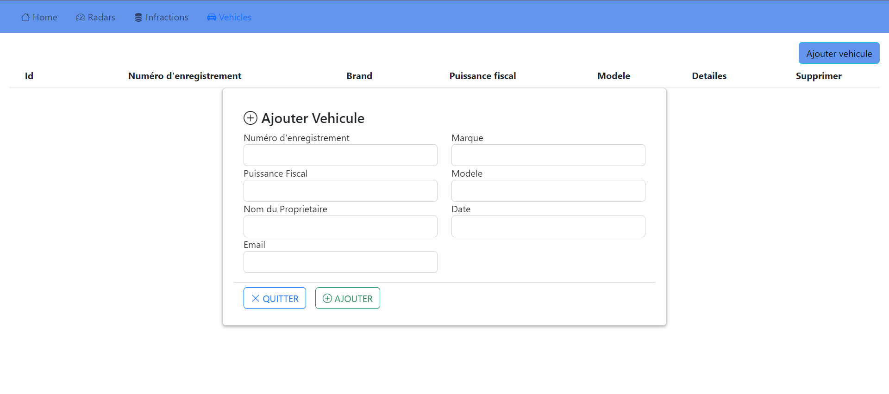
<h5>Base de donnees</h5>
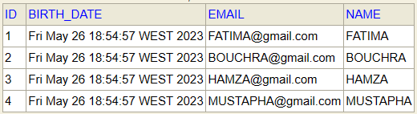
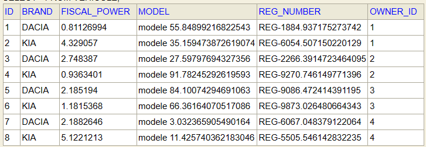
<h5>GraphQl</h5>
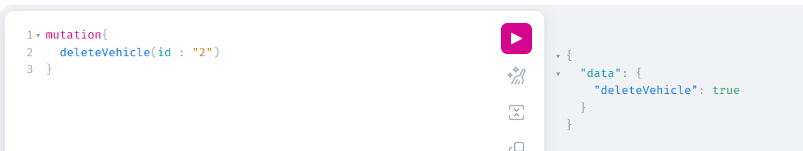
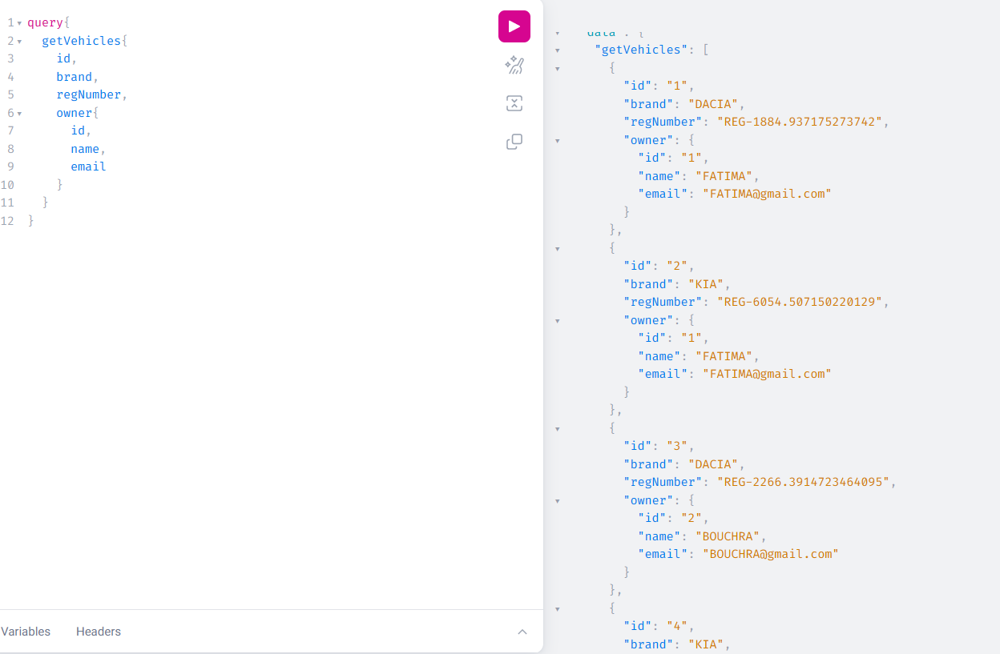
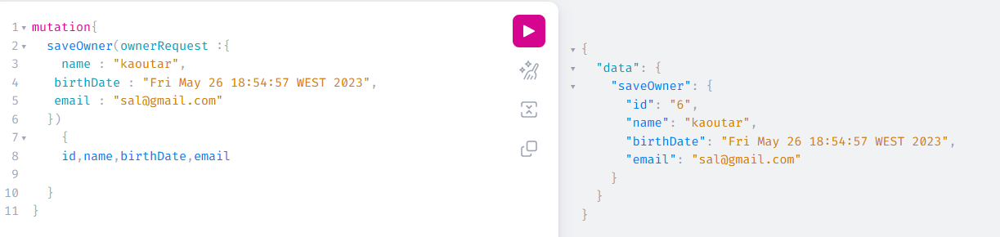
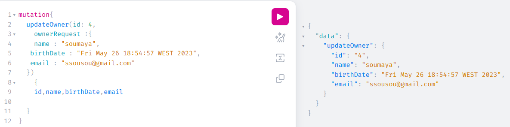
<h5>GRPC</h5>
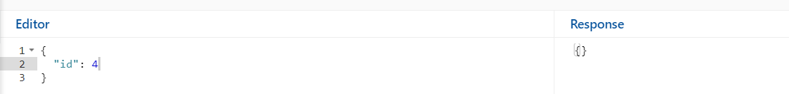
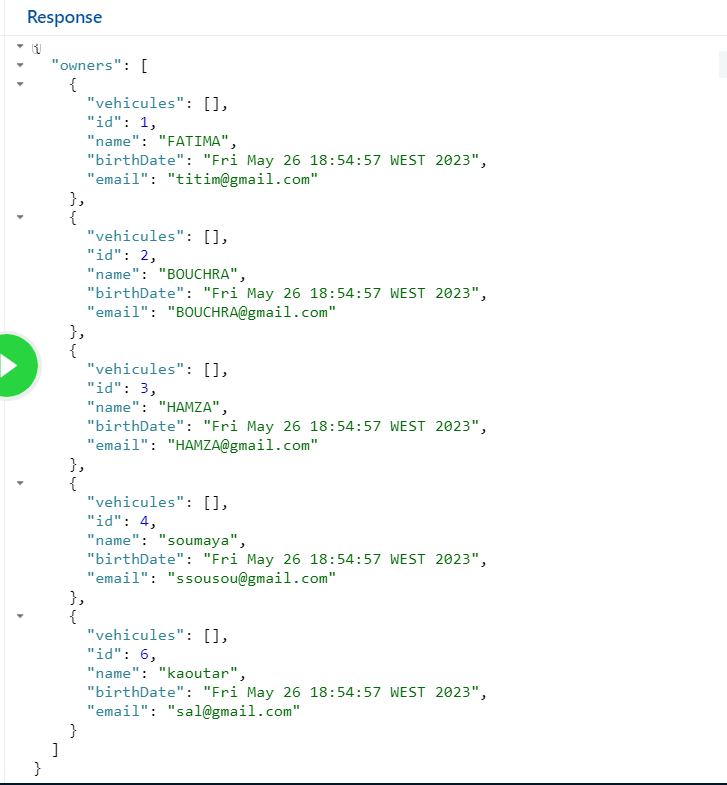
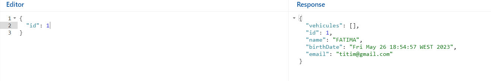
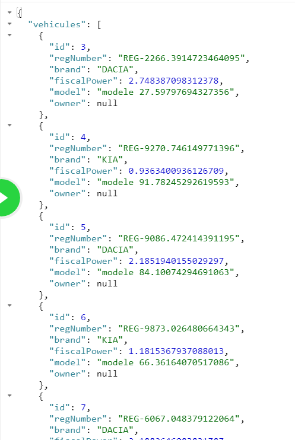
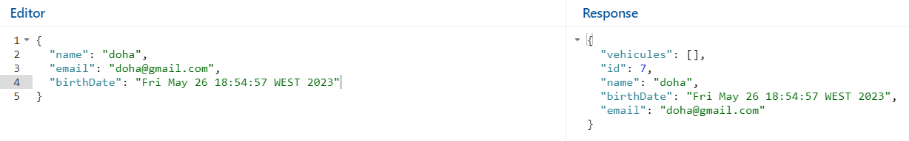
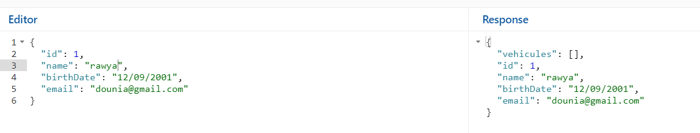
<h5>REST</h5>
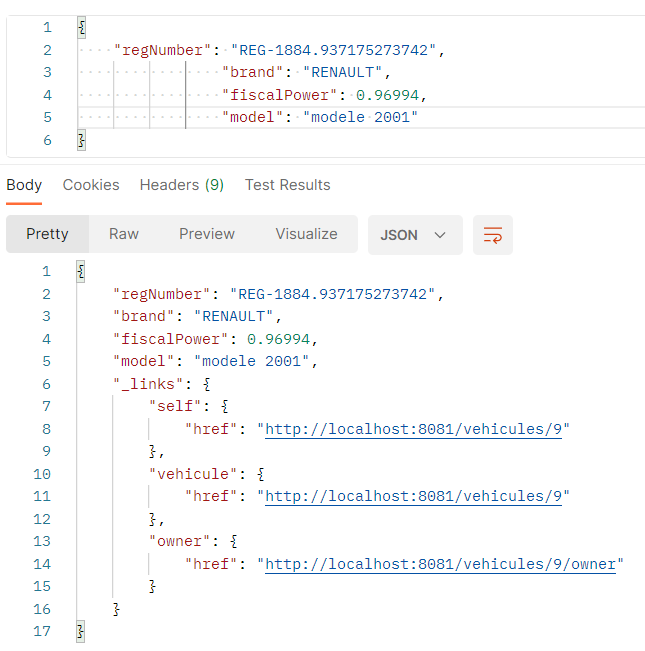
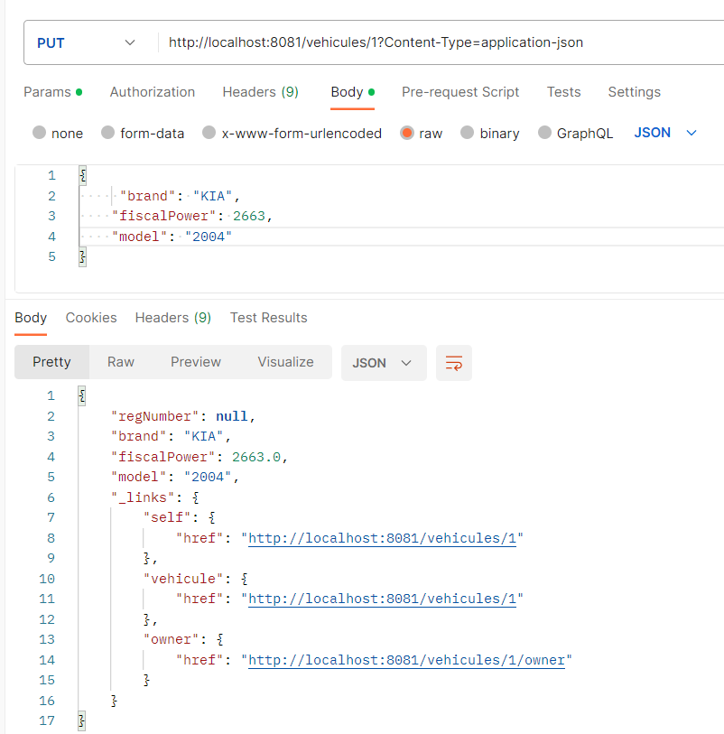
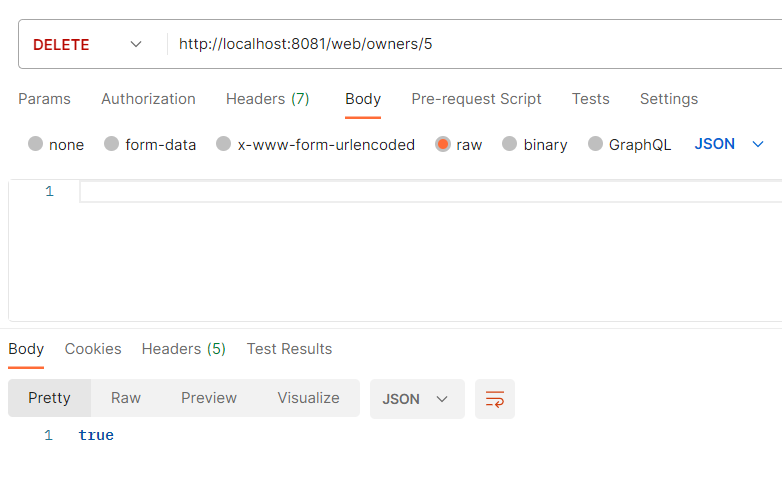
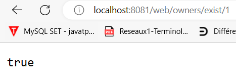
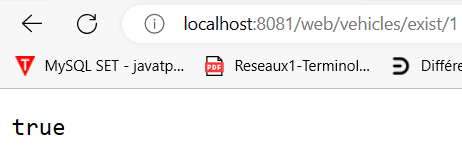
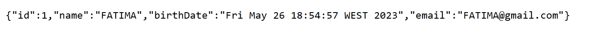
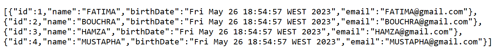
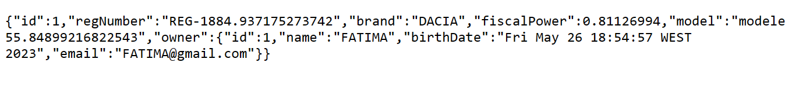
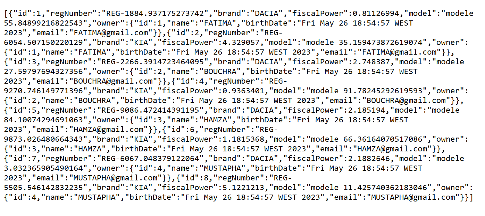
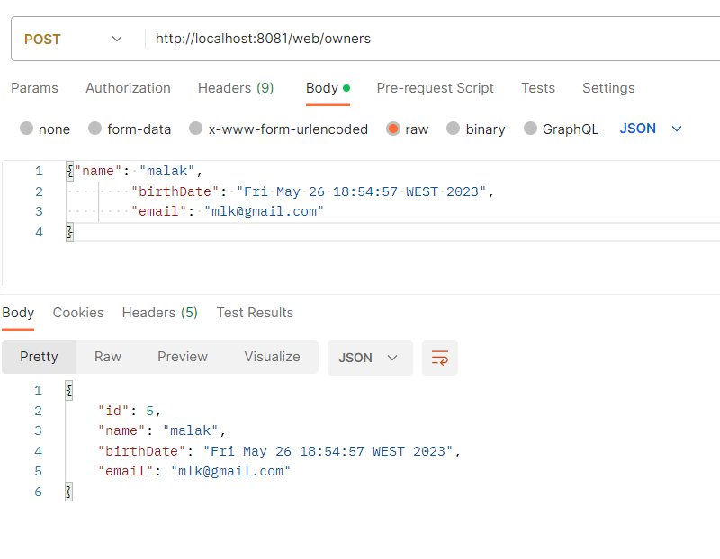
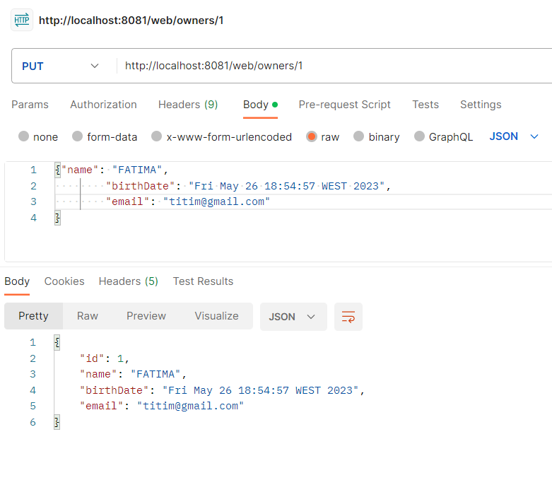
<h4>Infraction Service</h4>
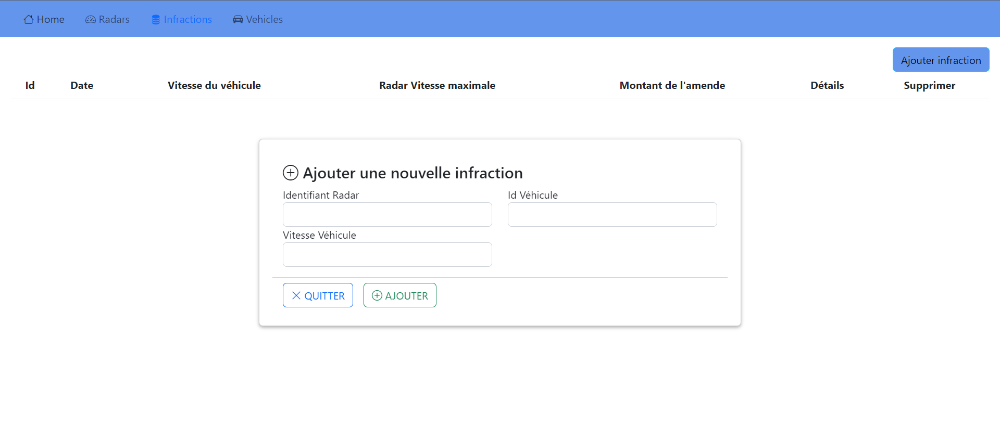
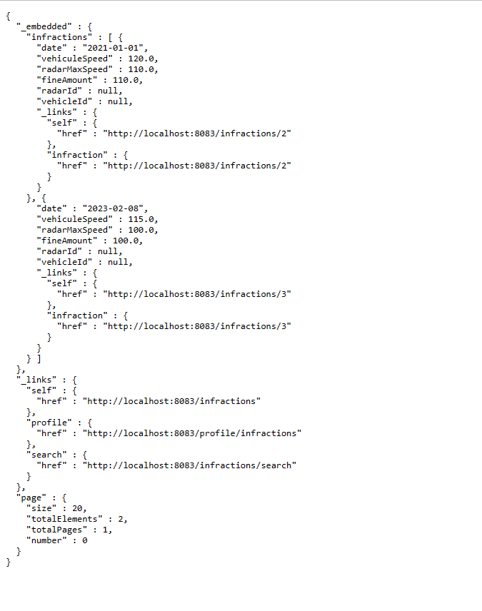
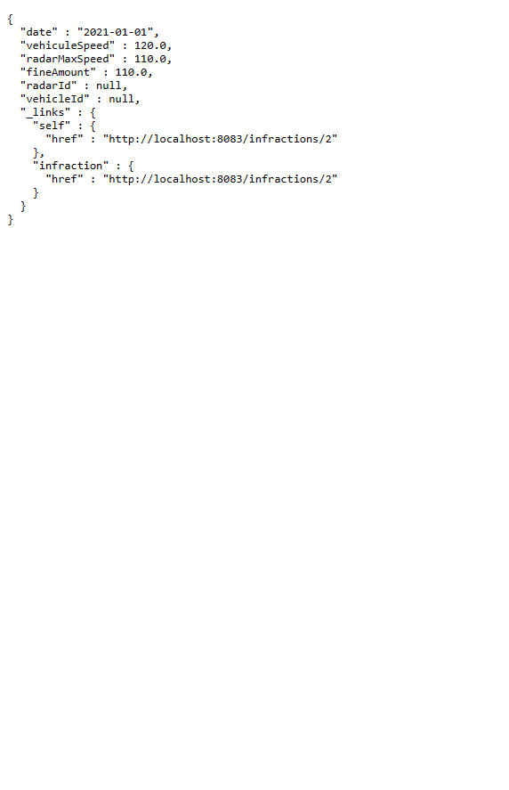
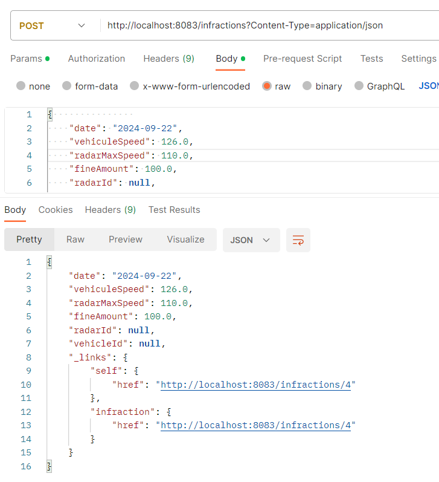
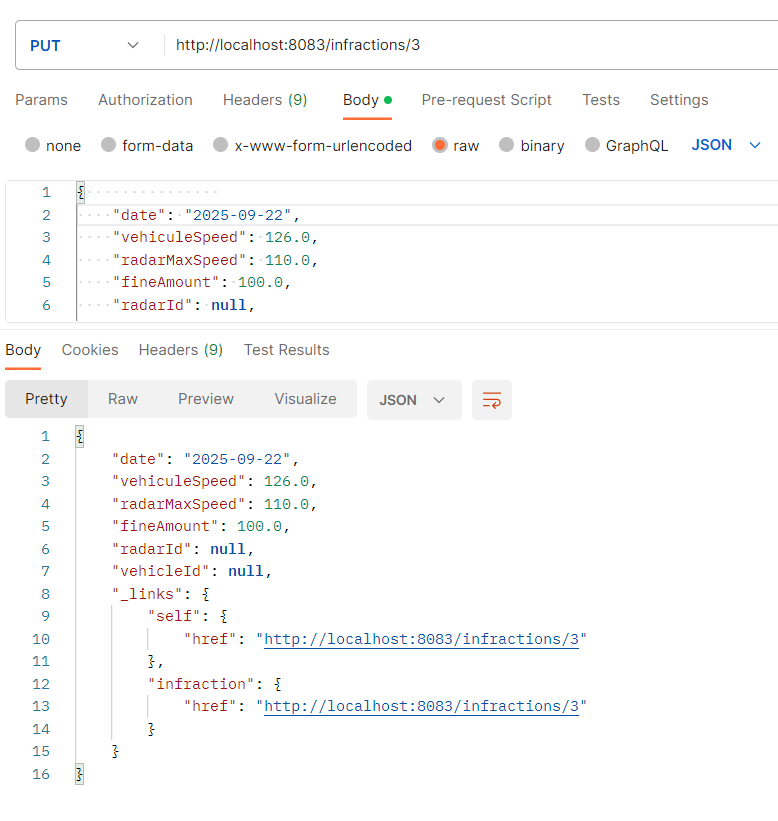

